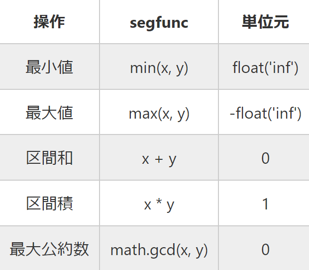

## 指定した要素を配列からすべて削除する
___
```
A = ["a", "b", "b", "b", "c",]
A = [n for n in A if n != "b"]
```

## 大文字小文字
___
#### 変換
```
str = "abcXYZ"
str.upper()
str.lower()
```
#### 判定
```
str.isupper()
str.islower()
```

## dict型のソート
___
##### ex)
```
mydict = {"banana": 3, "apple": 1, "orange": 2}
```
#### keyで並び替え
```
dict_sorted = sorted(mydict.items(), key = lambda x: x[0])
```
##### 結果
```
[("apple", 1), ("banana", 3), ("orange", 2)]
```
#### valueで並び替え
```
dict_sorted = sorted(mydict.items(), key = lambda x: x[1])
```
##### 結果
```
[("apple", 1), ("orange", 2), ("banana", 3)]
```
## 追加したデータをソートしていく O(lon(n))
___
```
import bisect

array = []
bisect.insort(array, 4)
bisect.insort(array, 7)
bisect.insort(array, 2)
```
##### 結果
```
[2, 4, 7]
```
## 配列の型を一つに指定する
___
```
import array

data = array.array("i", [])
```
[型のコードは以下のURLを参照]
(https://docs.python.org/ja/3/library/array.html)

## Union Find
___
```
import sys
sys.setrecursionlimit(10 ** 8)

par = [-1] * N

def root(x):
    if par[x] < 0:
        return x
    else:
        par[x] = root(par[x])
        return par[x]
 
def union(x, y):
    x = root(x)
    y = root(y)
    if x == y:
        return
    par[x] += par[y]
    par[y] = x
 
def size(x):
    x = root(x)
    return -par[x] 
```
## Counterの使い方
___
```
from collections import Counter

moji1 = "apple"
cnt1 = Counter(moji1)

moji2 = "average"
cnt2 = Counter(moji2)

print(cnt2 - cnt1)
```
##### 結果
```
Counter({"a": 1, "v": 1, "e": 1, "r": 1, "g": 1})
```
## 素因数分解
___
```
def primeNumber(N):
    primeList = [True] * (N + 1)
    primeList[0] = False
    primeList[1] = False
    
    for i in range(2, int(N ** (1 / 2) + 0.5) + 1):
        if primeList[i]:
            for j in range(2 * i, N + 1, i):
                primeList[j] = False
    
    prime = []
    
    for i in range(2, N + 1):
        if primeList[i]:
            prime.append(i)
    
    return prime

def factorization(n, prime):
    ret = []
    tmp = n
    for i in prime:
        if tmp % i == 0:
            cnt = 0
            while tmp % i == 0:
                cnt += 1
                tmp //= i
            ret.append([i, cnt])
    
    if tmp != 1:
        ret.append([tmp, 1])
    
    if ret == []:
        ret.append([n, 1])
    
    return ret

N = int(input())

prime = primeNumber(N)
print(factorization(N, prime))
```
## SortedSet
___
```
import math
from bisect import bisect_left, bisect_right
from typing import Generic, Iterable, Iterator, TypeVar, Union, List
T = TypeVar('T')

class SortedSet(Generic[T]):
    BUCKET_RATIO = 50
    REBUILD_RATIO = 170

    def _build(self, a=None) -> None:
        "Evenly divide `a` into buckets."
        if a is None: a = list(self)
        size = self.size = len(a)
        bucket_size = int(math.ceil(math.sqrt(size / self.BUCKET_RATIO)))
        self.a = [a[size * i // bucket_size : size * (i + 1) // bucket_size] for i in range(bucket_size)]
    
    def __init__(self, a: Iterable[T] = []) -> None:
        "Make a new SortedSet from iterable. / O(N) if sorted and unique / O(N log N)"
        a = list(a)
        if not all(a[i] < a[i + 1] for i in range(len(a) - 1)):
            a = sorted(set(a))
        self._build(a)

    def __iter__(self) -> Iterator[T]:
        for i in self.a:
            for j in i: yield j

    def __reversed__(self) -> Iterator[T]:
        for i in reversed(self.a):
            for j in reversed(i): yield j
    
    def __len__(self) -> int:
        return self.size
    
    def __repr__(self) -> str:
        return "SortedSet" + str(self.a)
    
    def __str__(self) -> str:
        s = str(list(self))
        return "{" + s[1 : len(s) - 1] + "}"

    def _find_bucket(self, x: T) -> List[T]:
        "Find the bucket which should contain x. self must not be empty."
        for a in self.a:
            if x <= a[-1]: return a
        return a

    def __contains__(self, x: T) -> bool:
        if self.size == 0: return False
        a = self._find_bucket(x)
        i = bisect_left(a, x)
        return i != len(a) and a[i] == x

    def add(self, x: T) -> bool:
        "Add an element and return True if added. / O(√N)"
        if self.size == 0:
            self.a = [[x]]
            self.size = 1
            return True
        a = self._find_bucket(x)
        i = bisect_left(a, x)
        if i != len(a) and a[i] == x: return False
        a.insert(i, x)
        self.size += 1
        if len(a) > len(self.a) * self.REBUILD_RATIO:
            self._build()
        return True

    def discard(self, x: T) -> bool:
        "Remove an element and return True if removed. / O(√N)"
        if self.size == 0: return False
        a = self._find_bucket(x)
        i = bisect_left(a, x)
        if i == len(a) or a[i] != x: return False
        a.pop(i)
        self.size -= 1
        if len(a) == 0: self._build()
        return True
    
    def lt(self, x: T) -> Union[T, None]:
        "Find the largest element < x, or None if it doesn't exist."
        for a in reversed(self.a):
            if a[0] < x:
                return a[bisect_left(a, x) - 1]

    def le(self, x: T) -> Union[T, None]:
        "Find the largest element <= x, or None if it doesn't exist."
        for a in reversed(self.a):
            if a[0] <= x:
                return a[bisect_right(a, x) - 1]

    def gt(self, x: T) -> Union[T, None]:
        "Find the smallest element > x, or None if it doesn't exist."
        for a in self.a:
            if a[-1] > x:
                return a[bisect_right(a, x)]

    def ge(self, x: T) -> Union[T, None]:
        "Find the smallest element >= x, or None if it doesn't exist."
        for a in self.a:
            if a[-1] >= x:
                return a[bisect_left(a, x)]
    
    def __getitem__(self, x: int) -> T:
        "Return the x-th element, or IndexError if it doesn't exist."
        if x < 0: x += self.size
        if x < 0: raise IndexError
        for a in self.a:
            if x < len(a): return a[x]
            x -= len(a)
        raise IndexError
    
    def index(self, x: T) -> int:
        "Count the number of elements < x."
        ans = 0
        for a in self.a:
            if a[-1] >= x:
                return ans + bisect_left(a, x)
            ans += len(a)
        return ans

    def index_right(self, x: T) -> int:
        "Count the number of elements <= x."
        ans = 0
        for a in self.a:
            if a[-1] > x:
                return ans + bisect_right(a, x)
            ans += len(a)
        return ans
```
## SortedMultiset
```
import math
from bisect import bisect_left, bisect_right, insort
from typing import Generic, Iterable, Iterator, TypeVar, Union, List
T = TypeVar('T')

class SortedMultiset(Generic[T]):
    BUCKET_RATIO = 50
    REBUILD_RATIO = 170

    def _build(self, a=None) -> None:
        "Evenly divide `a` into buckets."
        if a is None: a = list(self)
        size = self.size = len(a)
        bucket_size = int(math.ceil(math.sqrt(size / self.BUCKET_RATIO)))
        self.a = [a[size * i // bucket_size : size * (i + 1) // bucket_size] for i in range(bucket_size)]
    
    def __init__(self, a: Iterable[T] = []) -> None:
        "Make a new SortedMultiset from iterable. / O(N) if sorted / O(N log N)"
        a = list(a)
        if not all(a[i] <= a[i + 1] for i in range(len(a) - 1)):
            a = sorted(a)
        self._build(a)

    def __iter__(self) -> Iterator[T]:
        for i in self.a:
            for j in i: yield j

    def __reversed__(self) -> Iterator[T]:
        for i in reversed(self.a):
            for j in reversed(i): yield j
    
    def __len__(self) -> int:
        return self.size
    
    def __repr__(self) -> str:
        return "SortedMultiset" + str(self.a)
    
    def __str__(self) -> str:
        s = str(list(self))
        return "{" + s[1 : len(s) - 1] + "}"

    def _find_bucket(self, x: T) -> List[T]:
        "Find the bucket which should contain x. self must not be empty."
        for a in self.a:
            if x <= a[-1]: return a
        return a

    def __contains__(self, x: T) -> bool:
        if self.size == 0: return False
        a = self._find_bucket(x)
        i = bisect_left(a, x)
        return i != len(a) and a[i] == x

    def count(self, x: T) -> int:
        "Count the number of x."
        return self.index_right(x) - self.index(x)

    def add(self, x: T) -> None:
        "Add an element. / O(√N)"
        if self.size == 0:
            self.a = [[x]]
            self.size = 1
            return
        a = self._find_bucket(x)
        insort(a, x)
        self.size += 1
        if len(a) > len(self.a) * self.REBUILD_RATIO:
            self._build()

    def discard(self, x: T) -> bool:
        "Remove an element and return True if removed. / O(√N)"
        if self.size == 0: return False
        a = self._find_bucket(x)
        i = bisect_left(a, x)
        if i == len(a) or a[i] != x: return False
        a.pop(i)
        self.size -= 1
        if len(a) == 0: self._build()
        return True

    def lt(self, x: T) -> Union[T, None]:
        "Find the largest element < x, or None if it doesn't exist."
        for a in reversed(self.a):
            if a[0] < x:
                return a[bisect_left(a, x) - 1]

    def le(self, x: T) -> Union[T, None]:
        "Find the largest element <= x, or None if it doesn't exist."
        for a in reversed(self.a):
            if a[0] <= x:
                return a[bisect_right(a, x) - 1]

    def gt(self, x: T) -> Union[T, None]:
        "Find the smallest element > x, or None if it doesn't exist."
        for a in self.a:
            if a[-1] > x:
                return a[bisect_right(a, x)]

    def ge(self, x: T) -> Union[T, None]:
        "Find the smallest element >= x, or None if it doesn't exist."
        for a in self.a:
            if a[-1] >= x:
                return a[bisect_left(a, x)]
    
    def __getitem__(self, x: int) -> T:
        "Return the x-th element, or IndexError if it doesn't exist."
        if x < 0: x += self.size
        if x < 0: raise IndexError
        for a in self.a:
            if x < len(a): return a[x]
            x -= len(a)
        raise IndexError

    def index(self, x: T) -> int:
        "Count the number of elements < x."
        ans = 0
        for a in self.a:
            if a[-1] >= x:
                return ans + bisect_left(a, x)
            ans += len(a)
        return ans

    def index_right(self, x: T) -> int:
        "Count the number of elements <= x."
        ans = 0
        for a in self.a:
            if a[-1] > x:
                return ans + bisect_right(a, x)
            ans += len(a)
        return ans
```
##### 使い方
(https://github.com/tatyam-prime/SortedSet)
```
s = SortedSet()
# s = SortedMultiset()

s.a SortedSetの中身
len(s)
s[x] 下からx番目の要素を返す
s.add(n) nを追加
s.discard(n) nを削除
s.lt(n) nより小さい最大の要素
s.le(n) n以下の最大の要素
s.gt(n) nより大きい最小の要素
s.ge(n) n以上の最小の要素
s.count(x) sに含まれるxの個数を返す
s.index(n) nより小さい要素の個数
s.index_right(n) n以下の要素の個数
```
## 強連結成分分解(SCC)
___
```
import sys
sys.setrecursionlimit(10 ** 8)

def dfs(x):
    if come[x]: return
    come[x] = True
    for i in G[x]:
        dfs(i)
    backorder.append(x)

def rdfs(x):
    if come[x]: return
    come[x] = True
    components[-1].append(x)
    for i in rG[x]:
        rdfs(i)

N, M = map(int, input().split())
G = [[] for _ in range(N)]
rG = [[] for _ in range(N)]
for _ in range(M):
    a, b = map(lambda x: int(x) - 1, input().split())
    G[a].append(b)
    rG[b].append(a)

come = [False] * N
backorder = []

for i in range(N):
    if come[i]: continue
    dfs(i)

backorder.reverse()
come = [False] * N

# 強連結成分を格納するリスト
components = []

for i in backorder:
    if come[i]: continue
    components.append([])
    rdfs(i)
```
##### 解説
```
[AtCoder 典型90 021](https://atcoder.jp/contests/typical90/tasks/typical90_u)
[Youtube かつっぱ競プロ](https://www.youtube.com/watch?v=cRbst-d4Fho&t=1198s)
```
## セグメント木
```
#####segfunc#####
def segfunc(x, y):
    return 
#################

#####ide_ele#####
ide_ele = 
#################
class SegTree:
    def __init__(self,init_val,segfunc,ide_ele):
        n = len(init_val)
        self.segfunc = segfunc
        self.ide_ele = ide_ele
        self.num = 1<<(n-1).bit_length()
        self.tree = [ide_ele]*2*self.num
        for i in range(n):
            self.tree[self.num+i] = init_val[i]
        for i in range(self.num-1,0,-1):
            self.tree[i] = self.segfunc(self.tree[2*i],self.tree[2*i+1])
    def add(self,k,x):
        k += self.num
        self.tree[k] += x
        while k>1:
            self.tree[k>>1] = self.segfunc(self.tree[k],self.tree[k^1])
            k >>= 1
    def update(self,k,x):
        k += self.num
        self.tree[k] = x
        while k>1:
            self.tree[k>>1] = self.segfunc(self.tree[k],self.tree[k^1])
            k >>= 1
    def query(self,l,r):
        res = self.ide_ele
        l += self.num
        r += self.num
        while l<r:
            if l&1:
                res = self.segfunc(res,self.tree[l])
                l += 1
            if r&1:
                res = self.segfunc(res,self.tree[r-1])
            l >>= 1
            r >>= 1
        return res

seg = SegTree([0] * N, segfunc, ide_ele)
```
##### 使い方


##### 参考URL
[【Python】セグ木、遅延セグ木【AtCoder】](https://qiita.com/ether2420/items/7b67b2b35ad5f441d686)

## 凸包
___
```
def cross_product(moto, saki0, saki1):
  # moto->saki0 の直線に対し saki1がどちら側にあるか
  # >0 ならば 左側 <0 ならば 右側
  x0 = saki0[0] - moto[0]
  y0 = saki0[1] - moto[1]
  x1 = saki1[0] - moto[0]
  y1 = saki1[1] - moto[1]
  gaiseki = x0 * y1 - x1 * y0
  return cross_product

def wrap(ps):
  # ギフト包装法を使って凸包を求める。
  # 各点[x, y]をリストとして与えると凸包の各点をリストとして返す。
  qs = []
  # 最初の点
  x = [p[0] for p in ps]
  min_i = x.index(min(x))
  qs.append(ps[min_i]) # xが最小になる点をqs[0]とする。
  # 各点
  n = -1
  while True:
    n += 1
    for i in range(len(ps)):
      flag = False
      for p1 in ps:
        if qs[n] == ps[i]:
          flag = True
          break
        result = cross_product(qs[n], ps[i], p1)
        if result > 0 : # left
          flag = True
          break
      if flag == False:
        this_i = i
    if ps[this_i] == qs[0]:
      break
    qs.append(ps[this_i])
  return qs

# wrap(point)
# pointは座標をリスト型でまとめたもの
```